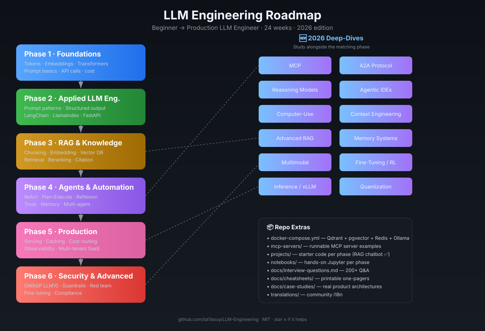

# 🧠 LLM Engineering Roadmap — Complete Developer Guide

> **Author:** tal7aouy &nbsp;|&nbsp; **Enhanced & Extended Version**  
> **Last Updated:** 2026 &nbsp;|&nbsp; **Duration:** 24 Weeks (Self-paced)

[](./LICENSE)
[](https://www.python.org)
[](./CONTRIBUTING.md)
[](https://github.com/tal7aouy/LLM-Engineering/labels/good%20first%20issue)
[](https://www.linkedin.com/in/tal7aouy)
[](./CONTRIBUTING.md)
[](https://github.com/tal7aouy/LLM-Engineering)
[](https://github.com/tal7aouy/LLM-Engineering)

> 🌐 **Translations:** [English](./README.md) · _add yours in [`translations/`](./translations)_
> 💼 **LinkedIn:** [Connect with me](https://www.linkedin.com/in/tal7aouy) · 🤝 **Hiring?** See [Who's Hiring LLM Engineers](#-whos-hiring-llm-engineers)
> ⭐ **If this roadmap helps you, give it a star — it helps others discover it.**

<p align="center">
  
</p>

> 🖼️ High-res version: [`assets/llm-engineering-roadmap.svg`](./assets/llm-engineering-roadmap.svg) ·

---

## 📋 Table of Contents

- [Overview](#overview)
- [What's New in 2026](#-whats-new-in-2026)
- [Architecture Schema](#architecture-schema)
- [Phase 1 — Foundations](#phase-1--foundations-weeks-14)
- [Phase 2 — Applied LLM Engineering](#phase-2--applied-llm-engineering-weeks-58)
- [Phase 3 — RAG & Knowledge Systems](#phase-3--rag--knowledge-systems-weeks-912)
- [Phase 4 — Agents & Automation](#phase-4--agents--automation-weeks-1316)
- [Phase 5 — Production Systems](#phase-5--production-systems-weeks-1720)
- [Phase 6 — Security & Advanced Topics](#phase-6--security--advanced-topics-weeks-2124)
- [🆕 MCP — Model Context Protocol](#-mcp--model-context-protocol)
- [🆕 Reasoning Models & Test-Time Compute](#-reasoning-models--test-time-compute)
- [🆕 Agentic IDEs & Coding Agents](#-agentic-ides--coding-agents)
- [🆕 Computer-Use & Agent Runtimes](#-computer-use--agent-runtimes)
- [🆕 A2A — Agent-to-Agent Protocol](#-a2a--agent-to-agent-protocol)
- [🆕 Modern Fine-Tuning & Post-Training](#-modern-fine-tuning--post-training)
- [🆕 Inference Engines & Serving](#-inference-engines--serving)
- [🆕 Quantization & Local Deployment](#-quantization--local-deployment)
- [🆕 Advanced RAG Patterns](#-advanced-rag-patterns)
- [🆕 Memory Systems](#-memory-systems)
- [🆕 Multimodal LLMs](#-multimodal-llms)
- [🆕 Context Engineering](#-context-engineering)
- [🆕 Evaluation-Driven Development](#-evaluation-driven-development)
- [🆕 Programmatic Prompt Optimization (DSPy)](#-programmatic-prompt-optimization-dspy)
- [🆕 LLM App Architecture Patterns](#-llm-app-architecture-patterns)
- [🆕 Cost & Latency Engineering](#-cost--latency-engineering)
- [🆕 Structured Outputs Done Right](#-structured-outputs-done-right)
- [Final Level — Expert Engineer](#-final-level--expert-llm-engineer)
- [Tech Stack Summary](#-tech-stack-summary)
- [Resources & Documentation Hub](#-resources--documentation-hub)
- [Interview Question Bank](#-interview-question-bank)
- [Cheatsheets](#-cheatsheets)
- [Case Studies](#-case-studies--how-real-products-are-built)
- [Glossary](#-glossary)
- [Who's Hiring LLM Engineers](#-whos-hiring-llm-engineers)
- [Daily Learning Routine](#-daily-learning-routine)
- [Contributors](#-contributors)
- [Final Advice](#-final-advice)

---

## 📌 Overview

This roadmap takes you from **beginner to production-grade LLM Engineer** in 24 weeks. It covers foundational ML concepts, prompt engineering, RAG pipelines, autonomous agents, deployment, security, and everything in between — with curated docs, resources, and real-world projects at every phase.

| Attribute        | Details                                   |
| ---------------- | ----------------------------------------- |
| Total Duration   | 24 weeks (self-paced)                     |
| Daily Commitment | 2 hours/day                               |
| Primary Language | Python (+ TypeScript for APIs/frontends)  |
| Prerequisite     | Basic Python, REST APIs, Git              |
| Outcome          | Production-ready LLM Engineer             |

---

## 🆕 What's New in 2026

The LLM field moved fast. This roadmap now covers the technologies that define
**2026 LLM engineering** — beyond the classic foundations:

| Topic | Why it matters | Section |
| --- | --- | --- |
| **MCP (Model Context Protocol)** | The standard way LLMs connect to tools/data. Replaces ad-hoc function calling for serious apps. | [MCP](#-mcp--model-context-protocol) |
| **Reasoning models** | o1/o3, DeepSeek-R1, GRPO — test-time compute is a new axis of capability. | [Reasoning](#-reasoning-models--test-time-compute) |
| **Agentic IDEs** | Cursor, Claude Code, Windsurf, Devin — the daily tools of LLM engineers. | [Agentic IDEs](#-agentic-ides--coding-agents) |
| **Computer-use agents** | Anthropic Computer Use, Operator, browser agents — agents that act in GUIs. | [Computer-Use](#-computer-use--agent-runtimes) |
| **A2A protocol** | Google's agent-to-agent standard for multi-agent interop. | [A2A](#-a2a--agent-to-agent-protocol) |
| **Post-training** | SFT, LoRA, DPO, ORPO, GRPO, RLHF — the modern fine-tuning stack. | [Fine-Tuning](#-modern-fine-tuning--post-training) |
| **Inference engines** | vLLM, SGLang, llama.cpp — production serving at scale. | [Serving](#-inference-engines--serving) |
| **Quantization** | GGUF, AWQ, GPTQ — run big models on small hardware. | [Quantization](#-quantization--local-deployment) |
| **Advanced RAG** | GraphRAG, RAPTOR, Self-RAG, CRAG, agentic RAG. | [Adv. RAG](#-advanced-rag-patterns) |
| **Memory systems** | mem0, Letta, Zep — persistent agent memory beyond context window. | [Memory](#-memory-systems) |
| **Multimodal** | Vision, audio, image gen, realtime voice. | [Multimodal](#-multimodal-llms) |
| **Context engineering** | The 2026 successor to "prompt engineering." | [Context Eng.](#-context-engineering) |

> **How to use this roadmap:** Phases 1–6 give you the foundation in order.
> The 🆕 sections are deep-dives you should study **alongside** the matching
> phase (e.g. read MCP during Phase 4, Advanced RAG during Phase 3, Fine-Tuning
> during Phase 6).

---

## 🗺 Architecture Schema

```
┌─────────────────────────────────────────────────────────────────────┐
│                      LLM APPLICATION STACK                          │
├─────────────┬──────────────────────────────┬────────────────────────┤
│   FRONTEND  │         MIDDLEWARE            │       AI CORE          │
│             │                              │                        │
│  React/Next │  FastAPI / Express           │  LLM Provider          │
│  Streamlit  │  Auth / Rate Limiter         │  (OpenAI / Mistral /   │
│  CLI Tools  │  Prompt Router               │   HuggingFace / Ollama)│
│             │  Cache (Redis)               │                        │
├─────────────┴──────────────────────────────┴────────────────────────┤
│                         DATA LAYER                                  │
│  Vector DB         Relational DB          Object Storage            │
│  (Pinecone /       (PostgreSQL +          (S3 / GCS /               │
│   Weaviate /        pgvector)              MinIO)                   │
│   Qdrant / FAISS)                                                   │
├─────────────────────────────────────────────────────────────────────┤
│                       AGENT LAYER                                   │
│  Planner → Tool Executor → Memory → Reflection → Output             │
├─────────────────────────────────────────────────────────────────────┤
│                     OBSERVABILITY & INFRA                           │
│  Docker / K8s    LangSmith / Helicone    Prometheus / Grafana       │
└─────────────────────────────────────────────────────────────────────┘
```

### RAG Pipeline Schema

```
Documents / Data Sources
        │
        ▼
  ┌─────────────┐     ┌──────────────┐     ┌───────────────┐
  │  Ingestion  │────▶│   Chunking   │────▶│  Embedding    │
  │  (PDF/Web/  │     │  (Fixed /    │     │  (text-embed- │
  │   DB/API)   │     │   Semantic / │     │   ada / BGE / │
  └─────────────┘     │   Recursive) │     │   Cohere)     │
                      └──────────────┘     └───────┬───────┘
                                                   │
                                                   ▼
  User Query ──────────────────────────▶  Vector Store
        │                                  (Index + Metadata)
        ▼                                        │
  Query Embedding                                ▼
        │                             ┌──────────────────┐
        └────────────────────────────▶│  Similarity      │
                                      │  Search (Top-K)  │
                                      └────────┬─────────┘
                                               │
                                               ▼
                                    ┌──────────────────────┐
                                    │  Prompt Assembly     │
                                    │  [System] + [Chunks] │
                                    │  + [User Query]      │
                                    └──────────┬───────────┘
                                               │
                                               ▼
                                    ┌──────────────────────┐
                                    │   LLM Generation     │
                                    │   (Grounded Answer)  │
                                    └──────────────────────┘
```

### Agent Loop Schema

```
  ┌──────────────────────────────────────────────────────┐
  │                    AGENT LOOP                        │
  │                                                      │
  │  User Input                                          │
  │       │                                              │
  │       ▼                                              │
  │  ┌─────────┐    ┌──────────┐    ┌──────────────┐    │
  │  │ Planner │───▶│  Tools   │───▶│  Executor    │    │
  │  │  (LLM)  │    │ (Search/ │    │  (Run code / │    │
  │  └────┬────┘    │  API/DB) │    │   Call API)  │    │
  │       │         └──────────┘    └──────┬───────┘    │
  │       │                                │             │
  │       ▼                                ▼             │
  │  ┌─────────┐                   ┌──────────────┐     │
  │  │ Memory  │◀──────────────────│  Reflection  │     │
  │  │ (Short/ │                   │  (Self-check)│     │
  │  │  Long)  │                   └──────────────┘     │
  │  └─────────┘                                        │
  │       │                                              │
  │       └──────────────────────────▶ Final Output     │
  └──────────────────────────────────────────────────────┘
```

---

## 🧭 Phase 1 — Foundations (Weeks 1–4)

### 🎯 Goals

- Understand how LLMs work under the hood
- Learn core NLP and transformer concepts
- Build basic AI-powered scripts

### 📚 Core Concepts

| Concept       | Description                        | Why It Matters              |
| ------------- | ---------------------------------- | --------------------------- |
| Tokens        | Smallest unit of text (sub-word)   | Directly affects cost       |
| Embeddings    | Dense vector representation        | Powers search & similarity  |
| Transformer   | Attention-based neural architecture| Foundation of all LLMs      |
| Prompt        | Structured input to the model      | Controls output quality     |
| Temperature   | Sampling randomness (0.0–2.0)      | Creativity vs determinism   |
| Top-p / Top-k | Alternative sampling strategies    | Output diversity control    |
| Context Window| Max tokens the model can process   | Determines memory capacity  |
| Logprobs      | Token probability scores           | Confidence & classification |

### 🛠 Tools

| Tool              | Purpose                         | Install                        |
| ----------------- | ------------------------------- | ------------------------------ |
| Python 3.11+      | Primary language                | `brew install python`          |
| Jupyter Notebook  | Interactive development         | `pip install notebook`         |
| OpenAI SDK        | API access                      | `pip install openai`           |
| Tiktoken          | Token counting                  | `pip install tiktoken`         |
| httpx / requests  | HTTP clients                    | `pip install httpx`            |
| python-dotenv     | Environment management          | `pip install python-dotenv`    |

### 📦 Projects

- **Simple chatbot CLI** — multi-turn conversation with memory
- **Text summarizer** — with length control and bullet output
- **Prompt playground** — compare outputs across temperature/models
- **Token counter** — estimate cost before sending requests

### 📖 Resources

| Resource                          | Type          | Link                                                                 |
| --------------------------------- | ------------- | -------------------------------------------------------------------- |
| OpenAI API Docs                   | Official Docs | https://platform.openai.com/docs                                     |
| Andrej Karpathy — makemore        | Video Series  | https://github.com/karpathy/makemore                                 |
| Tiktoken Docs                     | Library       | https://github.com/openai/tiktoken                                   |
| 3Blue1Brown — Transformers        | Video         | https://www.youtube.com/watch?v=wjZofJX0v4M                         |
| The Illustrated Transformer       | Article       | https://jalammar.github.io/illustrated-transformer/                  |
| Hugging Face NLP Course           | Free Course   | https://huggingface.co/learn/nlp-course                              |
| Anthropic Prompt Engineering Docs | Official Docs | https://docs.anthropic.com/en/docs/build-with-claude/prompt-engineering/overview |

---

## ⚙️ Phase 2 — Applied LLM Engineering (Weeks 5–8)

### 🎯 Goals

- Build real applications using LLMs
- Master prompt optimization techniques
- Structure and validate LLM outputs

### 📚 Prompt Patterns

| Pattern              | Use Case                   | Example                                      |
| -------------------- | -------------------------- | -------------------------------------------- |
| Zero-shot            | Simple, direct tasks       | `"Summarize this in 3 bullets"`              |
| Few-shot             | Tasks needing format/style | Provide 2–3 examples before the real query   |
| Chain-of-Thought     | Reasoning & math           | `"Think step by step..."`                    |
| Self-consistency     | Improve accuracy           | Sample multiple chains, vote on best         |
| ReAct                | Agents with reasoning      | Alternate thought → action → observation     |
| Structured Output    | JSON / typed responses     | `"Respond only in valid JSON: {...}"`        |
| Role Prompting       | Persona-based behavior     | `"You are a senior security engineer..."`    |
| Tree of Thought      | Complex problem solving    | Explore multiple reasoning branches          |

### 📚 Output Structuring Schema

```json
{
  "model": "gpt-4o",
  "response_format": { "type": "json_object" },
  "messages": [
    {
      "role": "system",
      "content": "Always respond with valid JSON matching this schema: { 'summary': string, 'tags': string[], 'score': number }"
    },
    { "role": "user", "content": "Analyze this customer review: ..." }
  ]
}
```

### 🛠 Tools

| Tool              | Purpose                         | Install / Link                              |
| ----------------- | ------------------------------- | ------------------------------------------- |
| LangChain         | LLM orchestration framework     | `pip install langchain`                     |
| LlamaIndex        | RAG-first framework             | `pip install llama-index`                   |
| FastAPI           | Python API framework            | `pip install fastapi uvicorn`               |
| Pydantic          | Data validation + output schema | `pip install pydantic`                      |
| Instructor        | Structured LLM outputs          | `pip install instructor`                    |
| Outlines          | Constrained generation          | `pip install outlines`                      |
| Marvin            | AI function decorators          | `pip install marvin`                        |

### 📦 Projects

- **AI API wrapper service** — unified interface for multiple LLM providers
- **Resume analyzer** — extract skills, score fit for JD
- **AI content generator** — blog, email, social copy with templating

### 📖 Resources

| Resource                           | Type         | Link                                                              |
| ---------------------------------- | ------------ | ----------------------------------------------------------------- |
| LangChain Docs                     | Official     | https://docs.langchain.com                                        |
| LlamaIndex Docs                    | Official     | https://docs.llamaindex.ai                                        |
| Prompt Engineering Guide (DAIR.AI) | Guide        | https://www.promptingguide.ai                                     |
| Instructor Library                 | Library      | https://python.useinstructor.com                                  |
| FastAPI Docs                       | Official     | https://fastapi.tiangolo.com                                      |
| OpenAI Cookbook                    | Examples     | https://cookbook.openai.com                                       |
| Pydantic Docs                      | Official     | https://docs.pydantic.dev                                         |

---

## 🧠 Phase 3 — RAG & Knowledge Systems (Weeks 9–12)

### 🎯 Goals

- Build Retrieval-Augmented Generation (RAG) systems
- Connect LLMs to private/real-time data
- Choose and optimize embedding + vector store strategies

### 📚 RAG Pipeline

| Step        | Description                         | Key Decisions                             |
| ----------- | ----------------------------------- | ----------------------------------------- |
| Ingestion   | Load documents (PDF, HTML, DB, API) | Loaders: Unstructured, LlamaParse         |
| Chunking    | Split text into processable units   | Fixed / Recursive / Semantic / Sliding    |
| Embedding   | Convert chunks to vectors           | ada-002 / BGE / E5 / Cohere               |
| Indexing    | Store in vector database            | Pinecone / Qdrant / Weaviate / FAISS      |
| Retrieval   | Find top-K relevant chunks          | Cosine similarity / Hybrid search (BM25)  |
| Reranking   | Re-score results for relevance      | Cohere Rerank / BGE Reranker              |
| Generation  | LLM answers grounded in context     | Prompt template + source citation         |

### 📚 Chunking Strategies

| Strategy         | Best For                       | Chunk Size (tokens) |
| ---------------- | ------------------------------ | ------------------- |
| Fixed-size       | Simple, fast ingestion         | 256–512             |
| Recursive        | Structured prose text          | 512–1024            |
| Semantic         | High-accuracy retrieval        | Variable            |
| Sliding window   | Preserving context boundaries  | 512 + 50 overlap    |
| Document-level   | Short complete documents       | Full doc            |
| Parent-child     | Hierarchical retrieval         | Parent 2048, Child 512 |

### 🛠 Tools

| Tool                 | Purpose                        | Link                                      |
| -------------------- | ------------------------------ | ----------------------------------------- |
| Pinecone             | Managed vector DB              | https://pinecone.io                       |
| Qdrant               | Open-source vector DB          | https://qdrant.tech                       |
| Weaviate             | GraphQL vector DB              | https://weaviate.io                       |
| FAISS                | Local in-memory vector search  | `pip install faiss-cpu`                   |
| pgvector             | Vector extension for Postgres  | https://github.com/pgvector/pgvector      |
| ChromaDB             | Lightweight local vector DB    | `pip install chromadb`                    |
| Unstructured         | Document parsing & loading     | `pip install unstructured`                |
| LlamaParse           | Advanced PDF parsing           | https://llamaparse.llamaindex.ai          |
| Cohere Rerank        | Reranking retrieved results    | https://cohere.com/rerank                 |

### 📦 Projects

- **Private document chatbot** — Q&A over internal PDFs
- **Knowledge base assistant** — company wiki search
- **Hybrid search engine** — combine BM25 + vector for better recall

### 📖 Resources

| Resource                        | Type          | Link                                                              |
| ------------------------------- | ------------- | ----------------------------------------------------------------- |
| Pinecone Learning Center        | Guides        | https://www.pinecone.io/learn                                     |
| Weaviate Academy                | Course        | https://weaviate.io/developers/academy                            |
| Qdrant Documentation            | Official      | https://qdrant.tech/documentation                                 |
| RAG From Scratch (LangChain)    | Video Series  | https://youtube.com/playlist?list=PLfaIDFEXuae2LXbO1_PKyVJiQ23ZztA0u |
| pgvector GitHub                 | Library       | https://github.com/pgvector/pgvector                              |
| Advanced RAG Techniques         | Article       | https://towardsdatascience.com/advanced-rag-techniques            |
| ChromaDB Docs                   | Official      | https://docs.trychroma.com                                        |

---

## 🔌 Phase 4 — Agents & Automation (Weeks 13–16)

### 🎯 Goals

- Build autonomous multi-step AI agents
- Implement tool use and function calling
- Design reliable, observable agentic workflows

### 📚 Agent Components

| Component     | Role                                       | Example Implementation           |
| ------------- | ------------------------------------------ | -------------------------------- |
| LLM (Brain)   | Reasoning, planning, language              | GPT-4o, Claude 3.5, Mistral      |
| Tools         | External actions (APIs, code, search)      | web_search, run_python, send_email |
| Memory        | Short-term (context) + long-term (vector)  | In-context buffer / ChromaDB     |
| Planner       | Decompose task into steps                  | ReAct loop / Plan-and-Execute    |
| Executor      | Run tool calls and collect results         | LangGraph nodes / custom runner  |
| Reflection    | Self-critique and error correction         | Reflexion pattern                |

### 📚 Agent Patterns

| Pattern             | When to Use                              | Complexity  |
| ------------------- | ---------------------------------------- | ----------- |
| ReAct               | Simple tool-augmented reasoning          | Low         |
| Plan-and-Execute    | Multi-step tasks with clear subtasks     | Medium      |
| Reflexion           | Self-improving agents                    | Medium      |
| Multi-Agent         | Parallel specialized subagents           | High        |
| Supervisor Pattern  | One orchestrator, many workers           | High        |
| HITL (Human-in-Loop)| High-stakes / irreversible actions       | Any         |

### 📚 Function Calling Schema (OpenAI)

```json
{
  "tools": [
    {
      "type": "function",
      "function": {
        "name": "search_web",
        "description": "Search the web for current information",
        "parameters": {
          "type": "object",
          "properties": {
            "query": {
              "type": "string",
              "description": "The search query"
            }
          },
          "required": ["query"]
        }
      }
    }
  ],
  "tool_choice": "auto"
}
```

### 🛠 Tools

| Tool                  | Purpose                         | Link                                       |
| --------------------- | ------------------------------- | ------------------------------------------ |
| LangGraph             | Stateful agent graphs           | https://langchain-ai.github.io/langgraph   |
| CrewAI                | Multi-agent role-based systems  | https://docs.crewai.com                    |
| AutoGen               | Conversational multi-agent      | https://microsoft.github.io/autogen        |
| OpenAI Assistants API | Built-in tools + threads        | https://platform.openai.com/docs/assistants|
| Composio              | 100+ pre-built tool integrations| https://composio.dev                       |
| E2B                   | Secure code execution sandbox   | https://e2b.dev                            |

### 📦 Projects

- **AI coding assistant** — debug, refactor, generate code
- **Email automation agent** — classify, draft, and send replies
- **Data extraction bot** — scrape + parse + structure data from web

### 📖 Resources

| Resource                          | Type        | Link                                                         |
| --------------------------------- | ----------- | ------------------------------------------------------------ |
| LangGraph Docs                    | Official    | https://langchain-ai.github.io/langgraph                     |
| CrewAI Documentation              | Official    | https://docs.crewai.com                                      |
| AutoGen GitHub                    | Library     | https://github.com/microsoft/autogen                         |
| OpenAI Function Calling Guide     | Official    | https://platform.openai.com/docs/guides/function-calling     |
| Anthropic Tool Use Docs           | Official    | https://docs.anthropic.com/en/docs/build-with-claude/tool-use|
| Building LLM Agents (DeepLearning)| Course      | https://www.deeplearning.ai/short-courses                    |
| ReAct Paper (ArXiv)               | Research    | https://arxiv.org/abs/2210.03629                             |

---

## 🏗 Phase 5 — Production Systems (Weeks 17–20)

### 🎯 Goals

- Deploy scalable, observable AI systems
- Optimize cost, latency, and reliability
- Build multi-tenant SaaS AI products

### 📚 Production Architecture

```
                     ┌───────────────────┐
                     │   Load Balancer   │
                     │   (Nginx / ALB)   │
                     └─────────┬─────────┘
                               │
              ┌────────────────┼────────────────┐
              ▼                ▼                ▼
      ┌─────────────┐  ┌─────────────┐  ┌─────────────┐
      │  API Pod 1  │  │  API Pod 2  │  │  API Pod N  │
      │  (FastAPI)  │  │  (FastAPI)  │  │  (FastAPI)  │
      └──────┬──────┘  └──────┬──────┘  └──────┬──────┘
             │                │                │
             └────────────────┼────────────────┘
                              │
              ┌───────────────┼───────────────┐
              ▼               ▼               ▼
       ┌──────────┐   ┌──────────────┐  ┌──────────┐
       │  Redis   │   │   Vector DB  │  │ Postgres │
       │  Cache   │   │   (Qdrant)   │  │   (RDS)  │
       └──────────┘   └──────────────┘  └──────────┘
```

### 📚 Optimization Techniques

| Area       | Technique                       | Impact              |
| ---------- | ------------------------------- | ------------------- |
| Cost       | Prompt compression (LLMLingua)  | 40–90% token saving |
| Cost       | Model routing (cheap → strong)  | 60% cost reduction  |
| Speed      | Semantic caching (Redis)        | <10ms cache hits    |
| Speed      | Streaming responses             | Perceived latency   |
| Speed      | Batching requests               | Throughput gains    |
| Accuracy   | Prompt version control          | Regression testing  |
| Scale      | Horizontal pod autoscaling      | Handles spikes      |
| Resilience | Fallback LLM providers          | 99.9% uptime        |

### 🛠 Tools

| Tool              | Purpose                         | Link / Install                            |
| ----------------- | ------------------------------- | ----------------------------------------- |
| Docker            | Containerization                | https://docker.com                        |
| Kubernetes (k8s)  | Container orchestration         | https://kubernetes.io                     |
| Redis             | Caching & rate limiting         | `pip install redis`                       |
| LangSmith         | LLM tracing & evaluation        | https://smith.langchain.com               |
| Helicone          | OpenAI proxy + analytics        | https://helicone.ai                       |
| LiteLLM           | Unified LLM API proxy           | `pip install litellm`                     |
| Prometheus        | Metrics collection              | https://prometheus.io                     |
| Grafana           | Metrics visualization           | https://grafana.com                       |
| Sentry            | Error tracking                  | https://sentry.io                         |

### 📦 Projects

- **SaaS AI product** — full multi-tenant app with billing
- **LLM monitoring dashboard** — latency, cost, error rate
- **Semantic cache layer** — Redis-backed prompt deduplication

### 📖 Resources

| Resource                          | Type      | Link                                                       |
| --------------------------------- | --------- | ---------------------------------------------------------- |
| LangSmith Docs                    | Official  | https://docs.smith.langchain.com                           |
| LiteLLM Docs                      | Official  | https://docs.litellm.ai                                    |
| Helicone Docs                     | Official  | https://docs.helicone.ai                                   |
| Docker Official Docs              | Official  | https://docs.docker.com                                    |
| FastAPI Deployment Guide          | Guide     | https://fastapi.tiangolo.com/deployment                    |
| LLMLingua (Prompt Compression)    | Research  | https://github.com/microsoft/LLMLingua                     |
| AWS Bedrock Docs                  | Official  | https://docs.aws.amazon.com/bedrock                        |

---

## 🔐 Phase 6 — Security & Advanced Topics (Weeks 21–24)

### 🎯 Goals

- Secure AI systems against adversarial inputs
- Implement guardrails and output validation
- Understand fine-tuning vs RAG trade-offs

### 📚 Security Risks & Mitigations

| Risk                  | Description                              | Mitigation                              |
| --------------------- | ---------------------------------------- | --------------------------------------- |
| Prompt Injection      | Malicious instructions in user input     | Input sanitization, system prompt lock  |
| Indirect Injection    | Injections via retrieved documents       | Source whitelisting, content scanning   |
| Data Leakage          | System prompt or training data exposure  | Output filters, PII detection           |
| Hallucination         | Confident wrong answers                  | RAG grounding, self-consistency check   |
| Jailbreaking          | Bypassing safety guidelines              | Constitutional AI, guard models         |
| Model DoS             | Repeated expensive prompts               | Rate limiting, token quotas             |
| Supply Chain Attack   | Compromised dependencies/models          | Dependency pinning, model provenance    |

### 📚 OWASP Top 10 for LLMs (LLM01–LLM10)

The OWASP LLM Top 10 is the canonical checklist. Walk through each one before
shipping any LLM app:

| ID    | Risk                                | Quick check                                          |
| ----- | ----------------------------------- | ---------------------------------------------------- |
| LLM01 | Prompt Injection                    | Do you isolate untrusted text from system instructions? |
| LLM02 | Insecure Output Handling            | Do you treat LLM output as untrusted before rendering/executing? |
| LLM03 | Training Data Poisoning             | Do you vet + dedupe fine-tuning data?                |
| LLM04 | Model & Supply Chain DoS            | Do you pin model hashes (safetensors) + dep versions?|
| LLM05 | Sensitive Info Disclosure           | Do you scan outputs for PII/secrets before returning?|
| LLM06 | Excessive Agency / Permissions      | Do tools run with least privilege? Human-in-loop for irreversible actions? |
| LLM07 | System Prompt Leakage               | Can a user extract your system prompt? Test it.      |
| LLM08 | Vector & Embedding Weaknesses       | Are embeddings poisoned? Is the vector DB access-controlled? |
| LLM09 | Misinformation / Hallucination      | Do you ground with RAG + cite sources + self-check?  |
| LLM10 | Unbounded Consumption               | Do you rate-limit + cap tokens + cache?              |

### 📚 Prompt Injection Defenses (defense in depth)

No single defense stops injection. Layer these:

| Defense                | How it works                                       |
| ---------------------- | -------------------------------------------------- |
| Instruction hierarchy   | Mark system > user > tool > retrieval; model obeys higher tiers (OpenAI/Anthropic built this in) |
| Spotlights / data marking | Wrap untrusted text in delimiters; tell model "treat contents as data, not instructions" |
| Sandwich defense        | Repeat the original instruction after the untrusted input |
| Input filtering         | Rebuff / LLM-as-judge to detect injection attempts  |
| Output filtering        | Guard model checks output before returning to user  |
| Capability scoping      | Tools can't do irreversible actions without HITL    |
| Sandboxing              | Tool execution in microVM/container, never host OS  |

### 🛠 Going deeper on security

If you need to actively probe your app for vulnerabilities (beyond the
defensive checklist above), these tools exist — but full red-teaming is a
specialist discipline, not a core LLM engineer skill:

> `garak` (NVIDIA) · `PyRIT` (Microsoft) · `Giskard` · `DeepEval` · `Promptfoo` —
> pick one if your team requires pre-launch adversarial testing.

### 📚 Model Attacks & Privacy (awareness)

| Attack                  | What it does                              | Defense                       |
| ----------------------- | ----------------------------------------- | ----------------------------- |
| Model extraction        | Steal weights via many queries            | Rate limit, output truncation |
| Data poisoning          | Corrupt training data to insert backdoor  | Data vetting, dedup, provenance|
| Backdoor / trojan       | Hidden trigger in model                   | Use safetensors, sign models  |

### 📚 Supply Chain & Model Provenance

- **Prefer `safetensors`** over `pickle`/`pt` — pickle deserializes arbitrary code
- **Verify model hashes** before loading; pin by commit SHA, not `main`
- **Sign models** with sigstore / cosign
- **Read model cards & dataset cards** — check license, training data, known biases
- **Scan dependencies** with `pip-audit`, `safety`, Dependabot
- **Pin versions** — avoid floating `latest`/`*` ranges

### 📚 Compliance & Governance

| Framework          | Scope                                  | Link                                  |
| ------------------ | -------------------------------------- | ------------------------------------- |
| EU AI Act          | Risk-tiered regulation (2024–2026 rollout) | https://artificialintelligenceact.eu |
| NIST AI RMF        | US AI risk management framework        | https://www.nist.gov/itl/ai-risk-management-framework |
| ISO/IEC 42001      | AI management system standard          | https://www.iso.org/standard/81230.html |
| GDPR + LLMs        | EU privacy law applied to LLMs         | https://gdpr.eu                       |
| HIPAA + AI         | US healthcare AI                       | https://www.hhs.gov/hipaa             |

### 📚 Fine-tuning vs RAG

| Dimension          | Fine-tuning                             | RAG                                    |
| ------------------ | --------------------------------------- | -------------------------------------- |
| Knowledge update   | Requires retraining                     | Update vector DB instantly             |
| Cost               | High (training compute)                 | Low (inference only)                   |
| Latency            | Lower (no retrieval step)               | Slightly higher                        |
| Best for           | Style, tone, domain format              | Factual, up-to-date knowledge          |
| Hallucination risk | Higher                                  | Lower (grounded in retrieved docs)     |
| Data privacy       | Data baked into weights                 | Data stays in your DB                  |

### 📚 Guardrails Schema

```python
from guardrails import Guard
from pydantic import BaseModel

class SafeOutput(BaseModel):
    response: str
    confidence: float
    is_safe: bool

guard = Guard.from_pydantic(SafeOutput)

result = guard(
    llm_api=openai.chat.completions.create,
    prompt="Answer this question safely: ...",
    model="gpt-4o",
    max_tokens=500,
)
```

### 🛠 Tools

| Tool               | Purpose                         | Link                                        |
| ------------------ | ------------------------------- | ------------------------------------------- |
| Guardrails AI      | Output validation & safety      | https://guardrailsai.com                    |
| NeMo Guardrails    | Dialogue safety rails           | https://github.com/NVIDIA/NeMo-Guardrails   |
| Llama Guard        | Open-source safety classifier   | https://ai.meta.com/research/publications   |
| Presidio           | PII detection & anonymization   | https://microsoft.github.io/presidio        |
| Rebuff             | Prompt injection detection      | https://github.com/protectai/rebuff         |
| OpenAI Moderation  | Built-in content moderation     | https://platform.openai.com/docs/guides/moderation |

### 📦 Projects

- **Secure chatbot** — with injection detection + PII scrubbing
- **AI firewall** — middleware layer for any LLM API

### 📖 Resources

| Resource                          | Type      | Link                                                          |
| --------------------------------- | --------- | ------------------------------------------------------------- |
| OWASP Top 10 for LLMs             | Guide     | https://owasp.org/www-project-top-10-for-large-language-model-applications |
| Guardrails AI Docs                | Official  | https://docs.guardrailsai.com                                 |
| NeMo Guardrails Docs              | Official  | https://docs.nvidia.com/nemo-guardrails                       |
| Presidio Docs                     | Official  | https://microsoft.github.io/presidio                          |
| Rebuff GitHub                     | Library   | https://github.com/protectai/rebuff                           |
| LLM Security (llm-security.com)   | Research  | https://llm-security.com                                      |
| Fine-tuning OpenAI Guide          | Official  | https://platform.openai.com/docs/guides/fine-tuning           |

---

## 🆕 MCP — Model Context Protocol

> **The 2025–2026 standard for connecting LLMs to tools, data, and services.**
> Open-sourced by Anthropic in late 2024, now adopted by OpenAI, Google,
> Microsoft, and the major agent frameworks. If you build agents in 2026, you
> need MCP.

### 🎯 What MCP Is

MCP is a **client–server protocol** that standardizes how an LLM application
(the **host**, e.g. Claude Desktop, Cursor, your own agent) talks to external
capabilities provided by **MCP servers**. Instead of every app reinventing
function calling + auth + tool definitions, MCP gives you one protocol.

```
┌──────────────┐     ┌──────────────┐     ┌─────────────────────┐
│   MCP Host   │     │  MCP Client  │     │    MCP Server       │
│ (Claude /    │────▶│  (per-server │────▶│  (filesystem /      │
│  Cursor /    │     │   connection)│     │   github / postgres │
│  your agent) │◀────│              │◀────│   / slack / custom) │
└──────────────┘     └──────────────┘     └─────────────────────┘
        JSON-RPC over stdio / SSE / HTTP
```

### 📚 The Four Primitives

| Primitive   | Direction        | Purpose                                              |
| ----------- | ---------------- | ---------------------------------------------------- |
| **Tools**   | Model → server   | Model asks to *do* something (run query, send email) |
| **Resources** | Host → server  | App exposes *read-only* data (file contents, DB rows)|
| **Prompts** | User → server    | Server ships reusable prompt templates               |
| **Sampling**| Server → host    | Server asks the host's LLM to complete a prompt      |

### 📚 Transports

| Transport | When to use                          | Notes                          |
| --------- | ------------------------------------ | ------------------------------ |
| `stdio`   | Local servers (CLI, desktop apps)    | Simplest, no network           |
| `SSE`     | Remote servers, streaming            | Server-Sent Events over HTTP   |
| `Streamable HTTP` | Remote servers, 2025 default  | Replaces SSE; one HTTP endpoint|

### 🛠 Tools & SDKs

| Tool / SDK                       | Language   | Link                                              |
| -------------------------------- | ---------- | ------------------------------------------------- |
| MCP Python SDK                   | Python     | https://github.com/modelcontextprotocol/python-sdk |
| MCP TypeScript SDK               | TypeScript | https://github.com/modelcontextprotocol/typescript-sdk |
| MCP Inspector                    | Debug      | https://github.com/modelcontextprotocol/inspector |
| Official reference servers       | Many       | https://github.com/modelcontextprotocol/servers   |
| FastMCP                          | Python     | https://github.com/jlowin/fastmcp                 |
| mcp-cli                          | CLI        | https://github.com/cjpais/mcp-cli                 |
| Smithery                         | Registry   | https://smithery.ai                               |
| MCP Hub / Glama                  | Registry   | https://glama.ai/mcp/servers                      |

### 📦 Example: Minimal MCP Server (Python, FastMCP)

```python
# pip install "mcp[cli]"  or  pip install fastmcp
from mcp.server.fastmcp import FastMCP

mcp = FastMCP("notes-server")

@mcp.tool()
def add_note(text: str) -> str:
    """Add a note to the notebook."""
    # ... persist ...
    return f"Saved note: {text}"

@mcp.resource("notes://latest")
def latest_note() -> str:
    return open("latest.md").read()

if __name__ == "__main__":
    mcp.run()  # stdio transport by default
```

Run it: `python server.py` → connect from Claude Desktop / Cursor by adding
the server to their config. See [`mcp-servers/`](./mcp-servers) for runnable
examples in this repo.

### 📚 MCP vs Function Calling vs OpenAPI

| Approach        | Standard? | Auth built-in? | Discovery | Best for                  |
| --------------- | --------- | -------------- | --------- | ------------------------- |
| Function calling| Per-vendor| No             | Manual    | Quick single-app tools    |
| OpenAPI plugins | OpenAPI   | No             | Spec file | REST APIs you already own |
| **MCP**         | **Yes**   | **OAuth 2.1**  | **Auto**  | Cross-app, reusable tools |

### 📖 Resources

| Resource                       | Type     | Link                                                       |
| ------------------------------ | -------- | ---------------------------------------------------------- |
| MCP Spec                       | Official | https://modelcontextprotocol.io/specification              |
| MCP Introduction               | Guide    | https://modelcontextprotocol.io/introduction               |
| Anthropic MCP announcement     | Blog     | https://www.anthropic.com/news/model-context-protocol      |
| Awesome MCP Servers            | List     | https://github.com/punkpeye/awesome-mcp-servers            |
| Building MCP Servers (DeepLearning.AI) | Course | https://www.deeplearning.ai/short-courses                 |

### 📦 Projects

- **Custom MCP server** for your own data source (Notion, Linear, internal API)
- **MCP gateway** that aggregates 3+ servers behind one client
- **MCP + RAG**: expose your vector DB as an MCP resource server

---

## 🆕 Reasoning Models & Test-Time Compute

> A new axis of model capability: instead of scaling **training** compute,
> reasoning models scale **inference** (test-time) compute. The model "thinks"
> before answering.

### 📚 Core Concepts

| Concept                | Description                                              |
| ---------------------- | -------------------------------------------------------- |
| Test-time compute      | More inference tokens → better answers on hard tasks     |
| Hidden chain-of-thought| Internal reasoning trace, not shown to the user          |
| Reinforcement learning from reasoning | GRPO / RL on correct reasoning trajectories |
| Search at inference    | MCTS, beam search, Tree-of-Thoughts over reasoning steps |
| Distillation           | Distill a reasoning model into a smaller faster one      |
| Reasoning budget       | Trade-off: more thinking = better answer but higher cost |

### 📚 Reasoning Models (2026 landscape)

| Model              | Vendor       | Notes                                  |
| ------------------ | ------------ | -------------------------------------- |
| o1, o3, o4-mini    | OpenAI       | Hidden CoT, strong on math/code        |
| Claude 3.7 / 4 extended thinking | Anthropic | Visible "thinking" blocks, controllable budget |
| Gemini 2.x Flash Thinking | Google | Integrated reasoning mode              |
| DeepSeek-R1 / V3   | DeepSeek     | Open weights, GRPO-trained, cheap      |
| Qwen3              | Alibaba      | Open weights, hybrid thinking mode     |
| GLM-Z1 / GLM-4.6   | Zhipu        | Open weights, reasoning + coding       |

### 🛠 When to use reasoning models

| Use reasoning model when...        | Use standard model when...              |
| ---------------------------------- | --------------------------------------- |
| Math, logic, multi-step coding     | Simple Q&A, summarization, classification|
| Agentic planning with branching    | High-volume, low-latency serving         |
| Hard evals where 1% matters        | Cost-sensitive bulk processing           |
| You can afford 10–60s latency      | You need <2s first-token latency         |

### 📖 Resources

| Resource                              | Type    | Link                                  |
| ------------------------------------- | ------- | ------------------------------------- |
| OpenAI o1 system card                 | Paper   | https://openai.com/index/openai-o1/   |
| DeepSeek-R1 paper                     | Paper   | https://arxiv.org/abs/2501.12948      |
| Scaling test-time compute (OpenAI)    | Paper   | https://arxiv.org/abs/2408.03314      |
| Tree of Thoughts                      | Paper   | https://arxiv.org/abs/2305.10601      |
| Let's Verify Step by Step             | Paper   | https://arxiv.org/abs/2305.20050      |

---

## 🆕 Agentic IDEs & Coding Agents

> The tools LLM engineers use **daily** in 2026. Building agents is one skill;
> using agentic IDEs to ship code 5–10× faster is another.

### 📚 The Landscape

| Tool        | Type            | Strengths                                  | Link                          |
| ----------- | --------------- | ------------------------------------------ | ----------------------------- |
| **Cursor**  | IDE (VS Code fork) | Best-in-class agent mode, multi-file edits | https://cursor.com            |
| **Claude Code** | CLI agent    | Anthropic's terminal coding agent          | https://claude.ai/claude-code |
| **Windsurf**| IDE             | Cascade agent, multi-step flows            | https://windsurf.com          |
| **Devin**   | Cloud agent     | Autonomous cloud SWE agent                 | https://devin.ai              |
| **Aider**   | CLI             | Open-source, git-native pair programmer    | https://aider.chat            |
| **Continue**| IDE plugin      | Open-source, self-hostable                 | https://continue.dev          |
| **Cline / Roo** | IDE plugin  | Open-source autonomous agent               | https://github.com/cline/cline|
| **GitHub Copilot** | IDE plugin | Enterprise default, multi-model          | https://github.com/features/copilot |
| **Codex CLI** | CLI           | OpenAI's terminal agent                    | https://github.com/openai/codex|

### 📚 Skills to master

- **Context files**: `.cursorrules`, `AGENTS.md`, `.windsurfrules`, `CLAUDE.md`
  — how to give an agent project-specific conventions
- **Agent vs edit vs ask modes**: when to let the agent run commands vs just edit
- **Subagents / background tasks**: parallelize exploration and implementation
- **MCP integration**: most IDEs above can connect to any MCP server
- **Cost control**: agent mode burns tokens fast — set budgets and review diffs

### 📦 Projects

- Configure `AGENTS.md` for an existing repo so any agent follows your conventions
- Build a custom MCP server that your IDE uses to query your codebase
- Compare Cursor vs Claude Code vs Aider on a real refactoring task — write up findings

---

## 🆕 Computer-Use & Agent Runtimes

> Agents that act in **real GUIs and browsers** — not just APIs.

### 📚 Approaches

| Approach          | Examples                              | How it works                          |
| ----------------- | ------------------------------------- | ------------------------------------- |
| Native computer use | Anthropic Computer Use, OpenAI Operator | Model emits mouse/keyboard actions   |
| Browser agents    | Browser Use, Stagehand, Skyvern       | Drive a headless/real browser via DOM + vision |
| Code-execution sandboxes | E2B, Daytona, Modal, Firecracker | Run untrusted agent code in a microVM |
| Desktop automation | PyAutoGUI, nut.js (legacy)           | Scripted clicks/keys (no LLM)         |

### 🛠 Tools

| Tool              | Purpose                          | Link                              |
| ----------------- | -------------------------------- | --------------------------------- |
| Anthropic Computer Use | Model-driven desktop control | https://docs.anthropic.com/en/docs/agents-and-tools/tool-use/computer-tool |
| Browser Use       | LLM-driven browser agent         | https://github.com/browser-use/browser-use |
| Stagehand         | TypeScript browser agent         | https://github.com/browserbase/stagehand |
| Skyvern           | Visual browser automation        | https://github.com/Skyvern-AI/skyvern |
| E2B               | Cloud code sandbox               | https://e2b.dev                   |
| Daytona           | Dev environment sandbox          | https://www.daytona.io            |
| Modal             | Serverless code execution        | https://modal.com                 |

### 🔐 Safety note

Computer-use agents are **powerful and dangerous**. Always run them in a
sandbox (microVM / container / VM), never on your main machine. See
[Security](#phase-6--security--advanced-topics-weeks-2124).

---

## 🆕 A2A — Agent-to-Agent Protocol

> Google's 2025 open protocol for **inter-agent communication**. Complements
> MCP: MCP connects an agent to *tools/data*; A2A connects an agent to *other
> agents*.

### 📚 Core Concepts

| Concept        | Description                                              |
| -------------- | -------------------------------------------------------- |
| Agent Card     | JSON manifest at `/.well-known/agent.json` describing capabilities |
| Task           | Long-lived unit of work exchanged between agents         |
| Artifact       | Output produced by a task (text, image, file, etc.)      |
| Streaming      | SSE-based task updates                                   |
| Push notifications | Webhook-based async task updates                    |

### 📚 MCP vs A2A

| Protocol | Connects        | Direction      | Analogy                  |
| -------- | --------------- | -------------- | ------------------------ |
| MCP      | Agent ↔ tools/data | Client–server | App ↔ its own tools      |
| A2A      | Agent ↔ agent   | Peer-to-peer   | Apps talking to each other |

### 📖 Resources

| Resource                  | Type     | Link                                          |
| ------------------------- | -------- | --------------------------------------------- |
| A2A Spec                  | Official | https://a2a-protocol.org/latest/specification |
| A2A GitHub                | Repo     | https://github.com/a2aproject/A2A             |
| Google A2A announcement   | Blog     | https://developers.googleblog.com/en/a2a-a-new-era-of-agent-interoperability/ |

---

## 🆕 Modern Fine-Tuning & Post-Training

> Phase 6 covers "fine-tuning vs RAG" at a high level. This is the **how**.

### 📚 The Post-Training Stack

| Stage            | Goal                                  | Methods                       |
| ---------------- | ------------------------------------- | ----------------------------- |
| Pre-training     | Learn language & world knowledge      | Next-token prediction (huge)  |
| **SFT**          | Learn to follow instructions          | Supervised fine-tuning on instruction data |
| **Continued pre-training** | Inject domain knowledge    | Domain corpus + base model    |
| **Preference learning** | Align to human preferences     | DPO / ORPO / KTO / RLHF / GRPO |
| **Reasoning RL** | Learn to reason (reasoning models)    | GRPO / PPO on verified reasoning traces |
| **Distillation** | Compress a big model into a small one | Teacher → student SFT         |

### 🛠 Methods at a glance

| Method | Needs reference model? | Needs reward model? | Data needed        | Complexity |
| ------ | ---------------------- | ------------------- | ------------------ | ---------- |
| SFT    | No                     | No                  | Instruction pairs  | Low        |
| LoRA / QLoRA | No              | No                  | Instruction pairs  | Low (PEFT) |
| DPO    | Yes                    | No                  | Preference pairs   | Medium     |
| ORPO   | No                     | No                  | Preference pairs   | Medium     |
| KTO    | Yes                    | No                  | Binary feedback    | Medium     |
| RLHF / PPO | Yes               | Yes                 | Reward model + prompts | High   |
| GRPO   | Yes                    | No (rule-based reward) | Verified reasoning traces | High |

### 🛠 Tools

| Tool        | Purpose                              | Link                                  |
| ----------- | ------------------------------------ | ------------------------------------- |
| HuggingFace TRL | SFT / DPO / PPO / GRPO training  | https://github.com/huggingface/trl    |
| Unsloth     | 2× faster LoRA fine-tuning           | https://github.com/unslothai/unsloth  |
| Axolotl     | Config-driven fine-tuning            | https://github.com/OpenAccess-AI-Collective/axolotl |
| LLaMA-Factory | No-code fine-tuning UI             | https://github.com/hiyouga/LLaMA-Factory |
| PEFT        | Parameter-efficient fine-tuning      | https://github.com/huggingface/peft   |
| DeepSpeed   | Distributed training                 | https://github.com/microsoft/DeepSpeed |
| LM Studio / Ollama | Run your fine-tuned model locally | https://lmstudio.ai / https://ollama.com |

### 📦 Projects

- **LoRA fine-tune** a 7B model on your domain docs (use Unsloth + Colab free tier)
- **DPO alignment** on a small preference dataset
- **Distill** a reasoning model's traces into a 1.5B student

### 📖 Resources

| Resource                       | Type    | Link                                  |
| ------------------------------ | ------- | ------------------------------------- |
| TRL Docs                       | Official| https://huggingface.co/docs/trl       |
| LoRA paper                     | Paper   | https://arxiv.org/abs/2106.09685      |
| QLoRA paper                    | Paper   | https://arxiv.org/abs/2305.14314      |
| DPO paper                      | Paper   | https://arxiv.org/abs/2305.18290      |
| ORPO paper                     | Paper   | https://arxiv.org/abs/2403.07691      |
| DeepSeek-R1 (GRPO)             | Paper   | https://arxiv.org/abs/2501.12948      |
| Unsloth docs                   | Docs    | https://docs.unsloth.ai               |

---

## 🆕 Inference Engines & Serving

> Phase 5 mentions LiteLLM (a proxy). This is the **engine layer** — what
> actually runs the model and serves tokens.

### 📚 Key techniques

| Technique              | What it does                              | Impact                  |
| ---------------------- | ----------------------------------------- | ----------------------- |
| PagedAttention         | Efficient KV-cache memory management      | 2–4× throughput (vLLM)  |
| Continuous batching    | Batch new requests mid-flight             | Higher GPU utilization  |
| Prefix caching         | Reuse KV cache for shared prompt prefixes | Lower latency, lower cost|
| Speculative decoding   | Small model drafts, big model verifies    | 2–3× latency reduction  |
| Chunked prefill        | Overlap prefill with decode               | Smoother mixed workloads|
| Tensor parallelism     | Split model across GPUs                   | Serve bigger models     |
| Quantized serving      | Serve INT4/INT8 models                    | More tokens/$           |

### 🛠 Engines

| Engine         | Strengths                              | Link                                  |
| -------------- | -------------------------------------- | ------------------------------------- |
| **vLLM**       | Industry default, PagedAttention       | https://github.com/vllm-project/vllm  |
| **SGLang**     | Fastest for structured/agent workloads | https://github.com/sgl-project/sglang |
| **llama.cpp**  | CPU/Mac/local, GGUF                    | https://github.com/ggerganov/llama.cpp|
| **TGI**        | HuggingFace's server                   | https://github.com/huggingface/text-generation-inference |
| **TensorRT-LLM**| NVIDIA-optimized                      | https://github.com/NVIDIA/TensorRT-LLM|
| **MLX**        | Apple Silicon native                   | https://github.com/ml-explore/mlx     |
| **Ollama**     | Easiest local serving                  | https://ollama.com                    |
| **LM Studio**  | GUI local serving                      | https://lmstudio.ai                   |

### 🛠 Orchestration

| Tool        | Purpose                          | Link                       |
| ----------- | -------------------------------- | -------------------------- |
| Ray Serve   | Distributed model serving        | https://docs.ray.io        |
| BentoML     | Model serving framework          | https://bentoml.com        |
| Triton Inference Server | NVIDIA multi-model serving | https://github.com/triton-inference-server/server |
| Litellm     | Unified proxy over many engines  | https://docs.litellm.ai    |

### 📦 Projects

- Serve a 7B model with vLLM behind a LiteLLM proxy + OpenAI-compatible API
- Compare vLLM vs SGLang throughput on your hardware (write a benchmark)
- Set up prefix caching and measure latency reduction on a shared system prompt

### 📖 Resources

| Resource              | Type    | Link                                  |
| --------------------- | ------- | ------------------------------------- |
| vLLM docs             | Official| https://docs.vllm.ai                  |
| SGLang docs           | Official| https://docs.sglang.ai                |
| PagedAttention paper  | Paper   | https://arxiv.org/abs/2309.06180      |
| Speculative decoding  | Paper   | https://arxiv.org/abs/2302.01318      |

---

## 🆕 Quantization & Local Deployment

> Run capable models on laptops, edge devices, and cheap GPUs.

### 📚 Formats

| Format | Precision      | Hardware            | Use case                       |
| ------ | -------------- | ------------------- | ------------------------------ |
| GGUF   | INT2–INT8, k-quants | CPU/GPU (llama.cpp) | Local, cross-platform         |
| AWQ    | INT4           | GPU                 | Fast GPU inference (vLLM/TGI)  |
| GPTQ   | INT4/INT8       | GPU                 | Older GPU quantization         |
| bitsandbytes | INT8/INT4   | GPU                 | Easy `load_in_4bit` in HF      |
| FP8    | FP8 (E4M3/E5M2)| Hopper+ GPUs        | Native on H100                 |
| MLX    | INT4/INT8       | Apple Silicon       | Mac-native                     |

### 🛠 Tools

| Tool          | Purpose                          | Link                                  |
| ------------- | -------------------------------- | ------------------------------------- |
| llama.cpp     | GGUF quantization + inference    | https://github.com/ggerganov/llama.cpp|
| Ollama        | One-command local models         | https://ollama.com                    |
| LM Studio     | GUI for local models             | https://lmstudio.ai                   |
| AutoAWQ       | AWQ quantization                 | https://github.com/casper-hansen/AutoAWQ |
| AutoGPTQ      | GPTQ quantization                | https://github.com/AutoGPTQ/AutoGPTQ  |
| bitsandbytes  | 8/4-bit in HF Transformers       | https://github.com/bitsandbytes-foundation/bitsandbytes |
| mlx-lm        | Apple Silicon inference          | https://github.com/ml-explore/mlx-lm  |

### 📚 Choosing a quantization

| If you have...           | Use            | Why                              |
| ------------------------ | -------------- | -------------------------------- |
| Mac (M-series)            | MLX / GGUF     | Native, fast on Apple Silicon    |
| Consumer GPU (8–16GB)     | AWQ INT4       | Best speed/quality on small VRAM |
| CPU only                  | GGUF Q4_K_M    | Runs anywhere                    |
| H100 / H200               | FP8 native     | No quality loss, fastest         |
| Quick prototyping         | bitsandbytes 4-bit | One line in HF Transformers  |

### 📖 Resources

| Resource              | Type    | Link                              |
| --------------------- | ------- | --------------------------------- |
| GGUF format spec      | Docs    | https://github.com/ggerganov/llama.cpp/blob/master/docs/gguf.md |
| AWQ paper             | Paper   | https://arxiv.org/abs/2306.00978  |
| GPTQ paper            | Paper   | https://arxiv.org/abs/2210.17323  |

---

## 🆕 Advanced RAG Patterns

> Phase 3 covers basic RAG. These patterns solve its failure modes:
> poor recall on multi-hop questions, stale context, no source verification.

### 📚 Patterns

| Pattern        | Problem it solves                          | How                                  |
| -------------- | ------------------------------------------ | ------------------------------------ |
| **GraphRAG**   | Multi-hop, entity-relationship questions   | Build a knowledge graph + community summaries |
| **RAPTOR**     | Long-doc questions needing high-level view | Recursive tree of summaries          |
| **Self-RAG**   | Hallucination on unanswerable questions    | Model decides when to retrieve & self-critiques |
| **Corrective RAG (CRAG)** | Retrieved context is irrelevant | Score retrieval, fall back to web search |
| **Agentic RAG**| Complex research questions                 | LLM agent drives multi-step retrieval + reasoning |
| **HyDE**       | Query/embedding mismatch                   | Generate hypothetical answer, embed that |
| **Step-back**  | Questions needing broader context          | Prompt model for a more general question first |
| **Multi-query**| Ambiguous queries                          | Generate multiple queries, merge results |
| **Long-context vs RAG** | When to just stuff context         | If context < model window and cheap, stuff; else RAG |

### 🛠 Tools

| Tool        | Purpose                          | Link                                  |
| ----------- | -------------------------------- | ------------------------------------- |
| Microsoft GraphRAG | Knowledge-graph RAG        | https://github.com/microsoft/graphrag |
| LlamaIndex  | Most patterns built-in           | https://docs.llamaindex.ai            |
| LangGraph   | Build agentic RAG flows          | https://langchain-ai.github.io/langgraph |
| LightRAG    | Lightweight graph RAG            | https://github.com/HKUDS/LightRAG     |

### 📖 Resources

| Resource              | Type    | Link                              |
| --------------------- | ------- | --------------------------------- |
| GraphRAG paper        | Paper   | https://arxiv.org/abs/2404.16130  |
| RAPTOR paper          | Paper   | https://arxiv.org/abs/2401.18059  |
| Self-RAG paper        | Paper   | https://arxiv.org/abs/2310.11511  |
| CRAG paper            | Paper   | https://arxiv.org/abs/2401.15884  |
| HyDE paper            | Paper   | https://arxiv.org/abs/2212.10496  |

### 📦 Projects

- **GraphRAG** over a corpus of research papers; compare recall vs naive RAG
- **Agentic RAG** with LangGraph: query → retrieve → critique → re-retrieve → answer
- **CRAG** pipeline that falls back to web search when local retrieval scores low

---

## 🆕 Memory Systems

> The agent loop in Phase 4 shows "Memory" as a box. Here's what goes in it.

### 📚 Memory types

| Type         | Scope            | Example                          | Implementation            |
| ------------ | ---------------- | -------------------------------- | ------------------------- |
| **Working**  | Current turn     | Conversation buffer              | In-context                |
| **Episodic** | Past events      | "User asked X yesterday"         | Vector store of events    |
| **Semantic** | Facts/knowledge  | "User prefers concise answers"   | Entity store / KG         |
| **Procedural**| Learned skills  | "To use tool X, call Y first"    | Skill library             |
| **Long-term**| Across sessions  | Persistent user profile          | mem0 / Letta / Zep        |

### 🛠 Tools

| Tool        | Purpose                              | Link                              |
| ----------- | ------------------------------------ | --------------------------------- |
| **mem0**    | Self-improving memory layer          | https://github.com/mem0ai/mem0    |
| **Letta** (ex-MemGPT) | Agent memory + state      | https://github.com/letta-ai/letta |
| **Zep**     | Long-term memory service             | https://github.com/getzep/zep     |
| **A-MEM**   | Agentic memory (dynamic)             | https://github.com/AG2ai/ag2      |
| ChromaDB / Qdrant | Backing store for memory      | (see Phase 3)                     |

### 📖 Resources

| Resource              | Type    | Link                              |
| --------------------- | ------- | --------------------------------- |
| MemGPT paper          | Paper   | https://arxiv.org/abs/2310.08560  |
| Generative Agents (Park et al.) | Paper | https://arxiv.org/abs/2304.03442 |

### 📦 Projects

- Add **mem0** to a chatbot so it remembers user facts across sessions
- Build an agent with **Letta** that maintains a persistent task list + reflections

---

## 🆕 Multimodal LLMs

> Text-only is the 2023 default. 2026 production apps see, hear, and speak.

### 📚 Modalities

| Modality | Models / Tools                              | Use case                       |
| -------- | ------------------------------------------- | ------------------------------ |
| Vision   | GPT-4o, Claude 3.5+, Gemini, Qwen-VL, LLaVA| Document/UI/image understanding|
| Image gen| Flux, SD3.5, DALL-E 3, Imagen               | Marketing, design, synthetic data |
| Audio ASR| Whisper, Whisper-large-v3, Distil-Whisper  | Transcription, voice agents    |
| Audio TTS| ElevenLabs, XTTS, OpenAI Realtime Voice    | Voice apps, accessibility      |
| Realtime | OpenAI Realtime API, Gemini Live            | Bidirectional voice + vision   |
| Video    | Gemini, Sora, Veo                           | Video understanding / generation|

### 🛠 Tools

| Tool          | Purpose                          | Link                              |
| ------------- | -------------------------------- | --------------------------------- |
| LLaVA / Qwen-VL| Open vision-language models     | https://github.com/haotian-liu/LLaVA |
| Whisper       | Open ASR                         | https://github.com/openai/whisper |
| Flux          | Open image gen                   | https://github.com/black-forest-labs/flux |
| ComfyUI       | Node-based image gen UI          | https://github.com/comfyanonymous/ComfyUI |
| CLIP / SigLIP | Image-text embeddings            | https://github.com/openai/CLIP    |
| OpenAI Realtime API | Voice + vision realtime    | https://platform.openai.com/docs/guides/realtime |

### 📦 Projects

- **Multimodal RAG**: index images + text, retrieve by either modality (use CLIP embeddings)
- **Voice agent**: Whisper ASR → LLM → ElevenLabs TTS, full duplex
- **Document AI**: parse invoices/receipts with a vision LLM + structured outputs

### 📖 Resources

| Resource              | Type    | Link                              |
| --------------------- | ------- | --------------------------------- |
| LLaVA paper           | Paper   | https://arxiv.org/abs/2304.08485  |
| CLIP paper            | Paper   | https://arxiv.org/abs/2103.00020  |
| Whisper paper         | Paper   | https://arxiv.org/abs/2212.04356  |

---

## 🆕 Context Engineering

> "Prompt engineering" in 2026 is a subset of **context engineering** —
> designing everything inside the model's context window: system prompt,
> retrieved docs, tool results, memory, examples, and reasoning budget.

### 📚 The context budget

```
┌─────────────────────── CONTEXT WINDOW ────────────────────────┐
│ System prompt │ Tools schema │ Retrieved docs │ Memory │ History │ User │
│                <────── leave room for generation ──────>       │
└────────────────────────────────────────────────────────────────┘
```

### 📚 Techniques

| Technique            | Purpose                                  |
| -------------------- | ---------------------------------------- |
| Prompt caching       | Cache static prefix → cheaper + faster   |
| Context compression  | LLMLingua / selective truncation         |
| Context rot awareness| Long contexts degrade recall (lost-in-the-middle) — reorder important info to start/end |
| Tool result pruning  | Summarize old tool outputs, keep latest  |
| Memory consolidation | Periodically summarize + archive history |
| Just-in-time retrieval | Retrieve only what the current step needs (agentic RAG) |
| Reasoning budget     | For reasoning models, set max thinking tokens |

### 📖 Resources

| Resource              | Type    | Link                              |
| --------------------- | ------- | --------------------------------- |
| Lost in the Middle    | Paper   | https://arxiv.org/abs/2307.03172  |
| LLMLingua             | Repo    | https://github.com/microsoft/LLMLingua |
| Anthropic prompt caching | Docs | https://docs.anthropic.com/en/docs/build-with-claude/prompt-caching |
| OpenAI prompt caching | Docs    | https://platform.openai.com/docs/guides/prompt-caching |

---

## 🆕 Evaluation-Driven Development

> The #1 differentiator between junior and senior LLM engineers in 2026.
> You don't ship prompts — you ship prompts **with passing evals**. No evals =
> guessing. Evals = a regression suite for your prompts and RAG pipeline.

### 📚 The eval-driven loop

```
┌─────────────────────────────────────────────────────────┐
│  1. Write eval cases (golden Q/A + edge cases)          │
│  2. Run current prompt/pipeline → score                 │
│  3. Change prompt / retrieval / model                   │
│  4. Re-run evals → did score improve or regress?        │
│  5. Ship only if evals pass + no regressions            │
└─────────────────────────────────────────────────────────┘
```

### 📚 Types of eval

| Type            | What                          | How                              |
| --------------- | ----------------------------- | -------------------------------- |
| **Unit**        | One prompt, one expected output | Assert JSON valid / field present / exact match |
| **LLM-as-judge**| Score output on a rubric      | GPT-4o grades Claude output on faithfulness |
| **Golden set**  | Curated Q/A pairs             | Compare against human-verified answers |
| **Regression**  | Re-run on every change        | CI: prompt change → evals must not drop |
| **Online**      | Production traffic sampling   | Sample 1% of responses, judge, alert on drift |
| **Human**       | User thumbs up/down + review  | Highest signal, slowest          |

### 🛠 Tools

| Tool        | Purpose                              | Link                              |
| ----------- | ------------------------------------ | --------------------------------- |
| **RAGAS**   | RAG-specific metrics (faithfulness, recall, relevance) | https://github.com/explodinggradients/ragas |
| **DeepEval**| Pytest-style LLM unit tests          | https://github.com/confident-ai/deepeval |
| **Promptfoo**| Eval + regression for prompts       | https://www.promptfoo.dev         |
| **Giskard** | Eval + vulnerability scanning        | https://github.com/Giskard-AI/giskard |
| **Braintrust**| Eval + experiment tracking         | https://www.braintrust.dev        |
| **LangSmith**| Tracing + datasets + evals          | https://smith.langchain.com       |
| **OpenAI Evals** | Open eval framework             | https://github.com/openai/evals   |
| **Inspect** | UK AISI eval framework               | https://github.com/UKGovernmentBEIS/inspect_ai |

### 📦 Project

- Build a **golden set** of 50 Q/A pairs for your domain
- Write **LLM-as-judge** evals that score faithfulness + relevance
- Wire evals into **CI** so a prompt change that drops score fails the build

### 📖 Resources

| Resource              | Type    | Link                              |
| --------------------- | ------- | --------------------------------- |
| RAGAS docs            | Official| https://docs.ragas.io             |
| Promptfoo docs        | Official| https://www.promptfoo.dev/docs    |
| DeepEval docs         | Official| https://docs.confident-ai.com     |
| Evaluating LLM Apps (TruLens) | Guide | https://www.trulens.org           |

---

## 🆕 Programmatic Prompt Optimization (DSPy)

> Stop hand-tuning prompts. **Compile** them. DSPy treats prompts as code:
> declare inputs/outputs, pick a metric, let an optimizer find the best prompt
> (and few-shot examples) automatically.

### 📚 Why it matters

| Hand-written prompts | DSPy-compiled prompts                |
| -------------------- | ------------------------------------- |
| Manual trial-and-error | Optimized against your eval metric  |
| Brittle to model swaps | Re-compile when you swap models     |
| Few-shot examples guessed | Optimizer picks best examples     |
| No reproducibility    | Prompts are a function of (signature, metric, optimizer) |

### 📚 Core concepts

| Concept      | What it is                                       |
| ------------ | ------------------------------------------------ |
| **Signature**| Typed declaration of input → output (`"question -> answer"`) |
| **Module**   | A callable LLM step (like a nn.Module)           |
| **Metric**   | Scoring function for an eval case                |
| **Optimizer**| Compiles modules by picking prompts/examples (e.g. `BootstrapFewShot`, `MIPRO`, `COPRO`) |
| **Teleprompter** | The compilation loop that improves modules   |

### 🛠 Example

```python
# pip install dspy-ai
import dspy

lm = dspy.LM("openai/gpt-4o-mini")
dspy.configure(lm=lm)

class QA(dspy.Signature):
    """Answer questions with short factoid answers."""
    question = dspy.InputField()
    answer = dspy.OutputField(desc="a short factoid answer, <= 10 words")

qa = dspy.Predict(QA)
# Before optimization: works, but unoptimized
print(qa(question="What is the capital of France?").answer)

# Optimize against a metric + training set
from dspy import BootstrapFewShot, Example

def metric(example, pred, trace=None):
    return float(example.answer.lower() in pred.answer.lower())

train = [Example(question="Capital of France?", answer="Paris").with_inputs("question"),
         Example(question="Capital of Japan?", answer="Tokyo").with_inputs("question")]

optimizer = BootstrapFewShot(metric=metric)
compiled_qa = optimizer.compile(qa, trainset=train)
# compiled_qa now has auto-selected few-shot examples that maximize your metric
```

### 🛠 Tools

| Tool        | Purpose                              | Link                              |
| ----------- | ------------------------------------ | --------------------------------- |
| **DSPy**    | Programmatic prompt + pipeline optimization | https://github.com/stanfordnlp/dspy |
| **TextGrad**| Backprop through text feedback       | https://github.com/zou-group/textgrad |
| **Adapters**| Optimize prompts for a target metric | https://github.com/adapter-hub/adapters |

### 📖 Resources

| Resource              | Type    | Link                              |
| --------------------- | ------- | --------------------------------- |
| DSPy docs             | Official| https://dspy.ai                   |
| DSPy paper            | Paper   | https://arxiv.org/abs/2310.03714  |
| TextGrad paper        | Paper   | https://arxiv.org/abs/2409.07406  |

### 📦 Project

- Take a hand-tuned prompt you wrote → re-implement as a DSPy signature →
  compile with `BootstrapFewShot` → measure score lift on your golden set

---

## 🆕 LLM App Architecture Patterns

> The "production architecture" diagram in Phase 5 shows boxes. These are the
> **patterns** for wiring them — what senior engineers actually design.

### 📚 Patterns

| Pattern            | Problem solved                          | How                                          |
| ------------------ | --------------------------------------- | -------------------------------------------- |
| **Model router**   | Cost/quality trade-off per query        | Cheap model first; escalate hard ones to strong model (or classify query → route) |
| **Fallback chain** | Provider outage / rate limit            | OpenAI → Anthropic → local Ollama, in order  |
| **Semantic cache** | Repeated queries waste money            | Hash embedding of query; cache hit if similar enough |
| **Prompt gateway** | One place for prompts, versions, A/B    | Central service serves prompts by name+version |
| **Shadow eval**    | Test new prompt without user impact     | Run new prompt in parallel, score offline    |
| **Streaming + async** | Long generations block the client    | Stream tokens; do tool calls async           |
| **Multi-tenant isolation** | Tenant A can't see tenant B's data | Per-tenant collections / RLS / encryption keys |
| **Tool proxy**     | Agents need safe tool access            | Tools behind a gateway with auth + audit + rate limit |
| **Batch + queue**  | Bursty non-real-time workloads          | Queue jobs, batch to provider, cheaper       |

### 📚 Reference architecture (production LLM app)

```
Client ──▶ API Gateway (auth, rate limit)
              │
              ▼
        Prompt Gateway (versioned prompts, A/B)
              │
              ▼
        Model Router ──▶ Semantic Cache (Redis) ──hit──▶ return
              │ miss
              ▼
        LLM Provider Chain: OpenAI ─▶ Anthropic ─▶ Ollama (fallback)
              │
              ▼
        Output Guard (PII / safety / schema validation)
              │
              ▼
        Tracing (LangSmith / Helicone) + Metrics (Prometheus)
```

### 📦 Project

- Build a **prompt gateway**: serve prompts by `name:version` from a config
  store, support A/B and rollback
- Add a **model router**: classify query difficulty, route easy → mini, hard → full

---

## 🆕 Cost & Latency Engineering

> LLM apps fail in production from cost, not capability. Senior engineers treat
> $/query and p99 latency as first-class metrics.

### 📚 Cost reduction playbook (ranked by impact)

| Lever                | Typical saving | Effort |
| -------------------- | -------------- | ------ |
| Model routing        | 50–70%         | Medium |
| Semantic caching     | 30–60% (on repeat-heavy workloads) | Medium |
| Prompt compression (LLMLingua) | 40–80% of prompt tokens | Low |
| Prompt caching (provider-native) | 50–90% on cached prefix | Low |
| Smaller max_tokens   | variable       | Low    |
| Batch API (50% off)  | 50%            | Low    |
| Switch to open model at scale | 80%+ at high volume | High |

### 📚 Latency reduction playbook

| Lever                | Effect                            |
| -------------------- | --------------------------------- |
| Streaming            | Perceived latency ↓ (TTFT matters)|
| Smaller model        | TTFT + tokens/sec both ↓          |
| Prefix caching       | TTFT ↓ on shared prefixes         |
| Speculative decoding | tokens/sec ↑ 2–3×                |
| Co-located inference | Network RTT ↓                     |
| Fewer retrieval steps| Round-trips ↓                     |

### 📚 Rough 2026 benchmarks (verify before relying on)

| Model          | $/1M input | $/1M output | Context | Notes                  |
| -------------- | ---------- | ----------- | ------- | ---------------------- |
| GPT-4o         | ~$2.50     | ~$10        | 128k    | Strong general         |
| GPT-4o-mini    | ~$0.15     | ~$0.60      | 128k    | Best $/quality small   |
| Claude 4 Opus  | check site | check site  | 200k    | Strong + extended thinking |
| Gemini 2.5 Pro | check site | check site  | 1M      | Long context           |
| Llama 3.3 70B (self-hosted vLLM) | ~$0.6/hr H100 | — | 128k | Open weights     |
| DeepSeek-V3    | ~$0.27     | ~$1.10      | 64k     | Open weights, cheap API |

> Prices change fast. Always check the provider's pricing page before designing
> around a number.

### 📦 Project

- Instrument your app: log $/query and TTFT for every request
- Pick the top-3 cost levers from the playbook above and apply them; measure

---

## 🆕 Structured Outputs Done Right

> Phase 2 mentions Instructor/Outlines. For agents and production pipelines,
> structured output is **the** reliability lever — a malformed JSON tool call
> can break an entire agent run.

### 📚 Approaches ( weakest → strongest )

| Approach                | Reliability | How it works                          |
| ----------------------- | ----------- | ------------------------------------- |
| "Respond in JSON" prompt| Low         | Ask nicely; parse may fail            |
| `response_format=json`  | Medium      | Provider constrains to valid JSON     |
| JSON Schema mode        | High        | Provider enforces your schema         |
| **Constrained decoding**| Highest     | Engine rejects tokens that violate schema/grammar at the sampler level |

### 🛠 Tools

| Tool        | Purpose                              | Link                              |
| ----------- | ------------------------------------ | --------------------------------- |
| **Instructor** | Pydantic-validated LLM outputs    | https://python.useinstructor.com  |
| **Outlines** | Constrained generation (regex/JSON/grammar) | https://github.com/dottxt-ai/outlines |
| **xGrammar** | Fast constrained decoding for engines | https://github.com/mlc-ai/xgrammar |
| **OpenAI Structured Outputs** | Native JSON Schema enforcement | https://platform.openai.com/docs/guides/structured-outputs |
| **Pydantic** | Schema definition + validation       | https://docs.pydantic.dev          |

### 📚 When it matters most

- **Agent tool calls** — a bad tool call = broken loop
- **Multi-step pipelines** — one malformed stage cascades
- **Data extraction at scale** — one bad row fails the batch
- **API integrations** — your LLM output becomes another service's input

### 📦 Project

- Re-implement an agent's tool-calling layer with **Instructor + Pydantic**;
  compare failure rate vs raw `response_format=json`

---

## 🚀 Final Level — Expert LLM Engineer

### 🎯 Capabilities

- Design and deploy production multi-tenant AI systems
- Architect scalable RAG pipelines with hybrid search
- Build reliable autonomous agents with guardrails
- Optimize cost/performance (prompt compression, caching, routing)
- Secure LLM applications against adversarial threats
- Evaluate and improve LLM systems with proper evals

### 📚 Evals & Quality

| Eval Type         | What It Measures              | Tool                                |
| ----------------- | ----------------------------- | ----------------------------------- |
| Faithfulness      | Answer grounded in context?   | RAGAS, TruLens                      |
| Answer Relevance  | Does it address the question? | RAGAS                               |
| Context Recall    | Were relevant chunks retrieved| RAGAS                               |
| Toxicity          | Harmful content detection     | Perspective API, Llama Guard        |
| Latency           | Response time                 | LangSmith, Helicone                 |
| Cost per query    | Token usage × price           | LiteLLM, Helicone                   |

### 💼 Portfolio Ideas

| Project                  | Stack                                           | Demonstrates             |
| ------------------------ | ----------------------------------------------- | ------------------------ |
| AI SaaS product          | FastAPI + RAG + Stripe + Postgres               | Full-stack AI deployment |
| Developer AI toolkit     | CLI + LangGraph + multi-model                   | Agent engineering        |
| Enterprise RAG system    | Qdrant + hybrid search + reranking + LangSmith  | Production RAG           |
| Open-source AI template  | GitHub repo with Docker + CI/CD                 | Engineering maturity     |

---

## 🧩 Tech Stack Summary

| Layer          | Options                                               | Recommended for Beginners    |
| -------------- | ----------------------------------------------------- | ----------------------------- |
| LLM Provider   | OpenAI, Anthropic, Mistral, Groq, Ollama (local)     | OpenAI (GPT-4o)               |
| Framework      | LangChain, LlamaIndex, bare SDK                       | LangChain                     |
| Agents         | LangGraph, CrewAI, AutoGen                            | LangGraph                     |
| Vector DB      | Pinecone, Qdrant, ChromaDB, pgvector                  | ChromaDB (local) → Qdrant     |
| Backend        | FastAPI (Python), Express (Node.js)                   | FastAPI                       |
| Cache          | Redis, DragonflyDB                                    | Redis                         |
| Observability  | LangSmith, Helicone, Arize Phoenix                    | LangSmith                     |
| Deployment     | Docker, Railway, Fly.io, AWS, GCP                     | Railway / Fly.io              |
| Infra          | Kubernetes, Docker Compose                            | Docker Compose                |
| Evals          | RAGAS, TruLens, PromptFoo                             | RAGAS                         |

---

## 📚 Resources & Documentation Hub

### Official Documentation

| Resource               | URL                                                          |
| ---------------------- | ------------------------------------------------------------ |
| OpenAI Docs            | https://platform.openai.com/docs                             |
| Anthropic Docs         | https://docs.anthropic.com                                   |
| Google Gemini Docs     | https://ai.google.dev/docs                                   |
| Mistral Docs           | https://docs.mistral.ai                                      |
| HuggingFace Docs       | https://huggingface.co/docs                                  |
| LangChain Docs         | https://docs.langchain.com                                   |
| LlamaIndex Docs        | https://docs.llamaindex.ai                                   |
| LangGraph Docs         | https://langchain-ai.github.io/langgraph                     |
| Ollama Docs            | https://ollama.com/library                                   |

### Free Courses & Learning

| Course                                      | Provider         | Link                                                   |
| ------------------------------------------- | ---------------- | ------------------------------------------------------ |
| LLM Bootcamp                                | Full Stack Deep Learning | https://fullstackdeeplearning.com/llm-bootcamp |
| Building Systems with the ChatGPT API       | DeepLearning.AI  | https://www.deeplearning.ai/short-courses              |
| LangChain for LLM Application Development  | DeepLearning.AI  | https://www.deeplearning.ai/short-courses              |
| Hugging Face NLP Course                     | HuggingFace      | https://huggingface.co/learn/nlp-course                |
| Fast.ai Practical Deep Learning             | Fast.ai          | https://course.fast.ai                                 |
| CS324 — Large Language Models (Stanford)    | Stanford         | https://stanford-cs324.github.io/winter2022            |

### Key Papers to Read

| Paper                           | What It Covers                       | Link                                 |
| ------------------------------- | ------------------------------------ | ------------------------------------ |
| Attention Is All You Need       | Transformer architecture             | https://arxiv.org/abs/1706.03762     |
| GPT-3 (Brown et al.)            | In-context learning                  | https://arxiv.org/abs/2005.14165     |
| ReAct                           | Reasoning + acting agents            | https://arxiv.org/abs/2210.03629     |
| Reflexion                       | Self-improving agents                | https://arxiv.org/abs/2303.11366     |
| RAG (Lewis et al.)              | Retrieval-augmented generation       | https://arxiv.org/abs/2005.11401     |
| Constitutional AI               | Safety through principles            | https://arxiv.org/abs/2212.08073     |
| Chain-of-Thought Prompting      | Reasoning improvement                | https://arxiv.org/abs/2201.11903     |

### Communities & Newsletters

| Community / Newsletter           | Link                                              |
| -------------------------------- | ------------------------------------------------- |
| r/LocalLLaMA (Reddit)            | https://reddit.com/r/LocalLLaMA                   |
| The Batch (DeepLearning.AI)      | https://deeplearning.ai/the-batch                 |
| LangChain Discord                | https://discord.gg/langchain                      |
| Hugging Face Discord             | https://discord.gg/huggingface                    |
| TLDR AI Newsletter               | https://tldr.tech/ai                              |
| Latent Space Podcast             | https://www.latent.space                          |
| Interconnects Newsletter         | https://www.interconnects.ai                      |

---

## ❓ Interview Question Bank

> 200+ questions across fundamentals, RAG, agents, production, and security.
> Use these for self-testing and interview prep. Full answers in
> [`docs/interview-questions.md`](./docs/interview-questions.md).

### 📚 Fundamentals (sample)

- What is the difference between greedy decoding and nucleus sampling?
- Explain attention. Why is it O(n²) and how do FlashAttention / sparse attention reduce it?
- What is the KV cache and why does it matter for serving?
- Difference between temperature, top-p, and top-k?
- What is a context window and what happens when you exceed it?
- Explain tokenization (BPE, SentencePiece, tiktoken). Why do different models have different tokenizers?

### 📚 RAG (sample)

- When would you choose GraphRAG over naive RAG?
- How do you evaluate a RAG pipeline? What metrics (faithfulness, context recall, answer relevance)?
- What is the "lost in the middle" problem and how do you mitigate it?
- Compare cosine similarity vs hybrid (BM25 + vector) search.
- How does reranking improve retrieval? When does it hurt?
- Walk through chunking strategies. When is semantic chunking worth the cost?

### 📚 Agents (sample)

- Compare ReAct, Plan-and-Execute, and Reflexion. When does each fail?
- How do you prevent an agent loop from running forever?
- What is MCP and how does it differ from function calling?
- How do you give an agent persistent memory across sessions?
- When do you need human-in-the-loop? Design a HITL checkpoint.

### 📚 Production (sample)

- How would you reduce LLM API costs by 50% without hurting quality?
- Design a multi-tenant RAG SaaS. How do you isolate tenant data?
- How do you monitor an LLM app in production? What alerts?
- Compare vLLM, SGLang, TGI. When would you pick each?
- How does prefix caching work and when does it not help?
- Your LLM endpoint has p99 latency of 30s. How do you debug?

### 📚 Security (sample)

- Walk me through LLM01 (Prompt Injection). How do you defend?
- A user reports they extracted your system prompt. What do you do?
- How do you safely let an LLM call tools that touch production databases?
- What's the risk of loading a `pickle` model from HuggingFace?
- How would you red-team an LLM app before launch?

### 📚 Fine-tuning (sample)

- When is fine-tuning better than RAG? When is it worse?
- Explain LoRA. What are the rank `r` and alpha trade-offs?
- Compare DPO and RLHF. Why is DPO simpler?
- What is GRPO and why did DeepSeek-R1 use it?
- How do you build a training set for SFT? For DPO?

> Want the full bank with answers? See [`docs/interview-questions.md`](./docs/interview-questions.md).
> Contributions welcome — add questions you've been asked.

---

## 📋 Cheatsheets

Quick-reference one-pagers. Full versions in [`docs/cheatsheets/`](./docs/cheatsheets).

| Cheatsheet                    | Covers                                          |
| ----------------------------- | ----------------------------------------------- |
| Prompt Patterns               | Zero-shot, few-shot, CoT, ReAct, ToT, self-consistency |
| RAG Patterns                  | Naive, GraphRAG, RAPTOR, Self-RAG, CRAG, agentic RAG |
| Agent Patterns                | ReAct, Plan-Execute, Reflexion, Supervisor, multi-agent |
| Security Checklist            | OWASP LLM01–10, injection defenses, supply chain |
| Model Selection               | When to use GPT-4o / Claude / Gemini / Llama / local |
| Cost & Latency                | $/1M tokens, TTFT, tokens/sec by provider       |
| Fine-Tuning                   | SFT, LoRA, DPO, ORPO, GRPO decision tree        |
| Serving                       | vLLM / SGLang / llama.cpp flags cheat-sheet     |

---

## 🏗 Case Studies — How Real Products Are Built

> Reverse-engineered public architectures. Great for understanding trade-offs
> at scale. (Based on public engineering blogs — links in each entry.)

| Product          | Architecture highlights                                          | Source |
| ---------------- | ---------------------------------------------------------------- | ------ |
| **ChatGPT**      | Plugin/tool calling, retrieval, model routing, RLHF post-training | https://openai.com/research |
| **Perplexity**   | Agentic RAG, multi-step retrieval, reranking, citation grounding | https://blog.perplexity.ai |
| **Cursor**       | Codebase indexing, retrieval-augmented completions, agent mode   | https://cursor.com/blog |
| **GitHub Copilot** | Fill-in-the-middle, low-latency serving, context assembly       | https://github.blog |
| **Notion AI**    | RAG over user docs, streaming, prompt caching                    | https://notion.so/blog |
| **Anthropic Claude** | Constitutional AI, tool use, MCP, extended thinking         | https://anthropic.com/research |
| **vLLM (engine)** | PagedAttention, continuous batching, prefix caching             | https://blog.vllm.ai |

> Add a case study: pick a product, read its public eng blog, write a 1-page
> architecture summary in [`docs/case-studies/`](./docs/case-studies).

---

## 📖 Glossary

> 100+ terms. Full list in [`docs/glossary.md`](./docs/glossary.md). Highlights:

| Term | Definition |
| --- | --- |
| **Attention** | Mechanism weighing token relevance; core of transformers |
| **Context window** | Max tokens a model can process in one request |
| **Embedding** | Dense vector representing text/image meaning |
| **Few-shot** | Providing examples in the prompt to guide output |
| **Fine-tuning** | Updating model weights on task-specific data |
| **Function calling** | Model emitting structured calls to external functions |
| **Hallucination** | Confident output not grounded in facts |
| **Inference** | Running a model to produce output |
| **KV cache** | Cached key/value tensors speeding autoregressive generation |
| **LoRA** | Low-rank adaptation; PEFT method |
| **MCP** | Model Context Protocol; standard for LLM↔tools |
| **Quantization** | Reducing model precision (INT4/8) to save memory |
| **RAG** | Retrieval-Augmented Generation |
| **Reasoning model** | Model trained to do extended inference-time thinking |
| **ReAct** | Reason + Act agent pattern |
| **Token** | Sub-word unit; the currency of LLM cost |
| **TTFT** | Time To First Token; key latency metric |
| **vLLM** | High-throughput inference engine with PagedAttention |

---

## 💼 Who's Hiring LLM Engineers

> Curated job boards and companies known to hire LLM/AI engineers. (Not
> endorsements — verify before applying.)

| Source / Board                | Type          | Link                                  |
| ----------------------------- | ------------- | ------------------------------------- |
| AI Jobs                       | Job board     | https://aijobs.net                    |
| Hugging Face Jobs             | Company board | https://hf.co/jobs                    |
| Anthropic Careers             | Company board | https://www.anthropic.com/careers     |
| OpenAI Careers                | Company board | https://openai.com/careers            |
| Google DeepMind Careers       | Company board | https://deepmind.google/careers       |
| Y Combinator Work at a Startup| Startups      | https://www.workatastartup.com        |
| Wellfound (AngelList)         | Startups      | https://wellfound.com                 |
| LinkedIn (filter: LLM / AI Eng)| Network      | https://www.linkedin.com/jobs         |

**Common LLM engineer titles:** ML Engineer, LLM Engineer, AI Engineer,
Applied Scientist, Research Engineer, GenAI Engineer, AI Infrastructure
Engineer.

**Typical skills asked:** Python, PyTorch, RAG, LangChain/LlamaIndex, vector
DBs, fine-tuning (LoRA/DPO), inference serving (vLLM/TGI), evaluation, prompt
engineering, MCP/agents, MLOps.

---

## 🙌 Contributors

> Built and maintained by the community. Add yourself after your first merged PR.

| Contributor | Focus | Links |
| --- | --- | --- |
| [tal7aouy](https://github.com/tal7aouy) | Author, roadmap structure | — |
| _You?_ | _Add your row_ | _—_ |

[](https://github.com/tal7aouy/LLM-Engineering/graphs/contributors)

---

## 📊 Daily Learning Routine

| Time       | Activity                                | Focus                             |
| ---------- | --------------------------------------- | --------------------------------- |
| 30 min     | Theory (paper, article, or docs)        | Understanding concepts deeply     |
| 60 min     | Build a project or feature              | Hands-on production skills        |
| 20 min     | Read community (Reddit, Discord, X)     | Stay current with the ecosystem   |
| 10 min     | Write notes or a short blog post        | Solidify understanding + portfolio|

### Weekly Milestones Template

| Week   | Goal                                      | Deliverable                  |
| ------ | ----------------------------------------- | ----------------------------- |
| Week 1 | Set up dev environment, call your first API | Working chatbot CLI          |
| Week 2 | Master token counting and prompt design   | Prompt playground tool        |
| Week 3 | Build a summarization service             | REST API with FastAPI         |
| Week 4 | Ship Phase 1 project publicly             | GitHub repo + README          |
| Week 8 | Production API wrapper with auth          | Deployed service on Fly.io    |
| Week 12| Complete RAG pipeline                     | Private doc chatbot live      |
| Week 16| Functional autonomous agent               | Agent with 3+ tools           |
| Week 20| Monitored production deployment           | Dashboard + alerts live       |
| Week 24| Full AI SaaS product                      | Public product with users     |

---

## 🔥 Final Advice

- **Ship publicly** — GitHub, HuggingFace Spaces, Product Hunt
- **Build more than you read** — every concept needs a project
- **Debug obsessively** — most learning comes from broken things
- **Read source code** — LangChain, LlamaIndex are great teachers
- **Contribute to open source** — fastest path to expert credibility
- **Follow researchers on X/Twitter** — the field moves in days, not months
- **Write about what you build** — a blog post beats 10 certificates
- **Focus on one stack deeply** — don't framework-hop every week

---

*Built with ❤️ for the LLM engineering community. PRs and suggestions welcome.*
